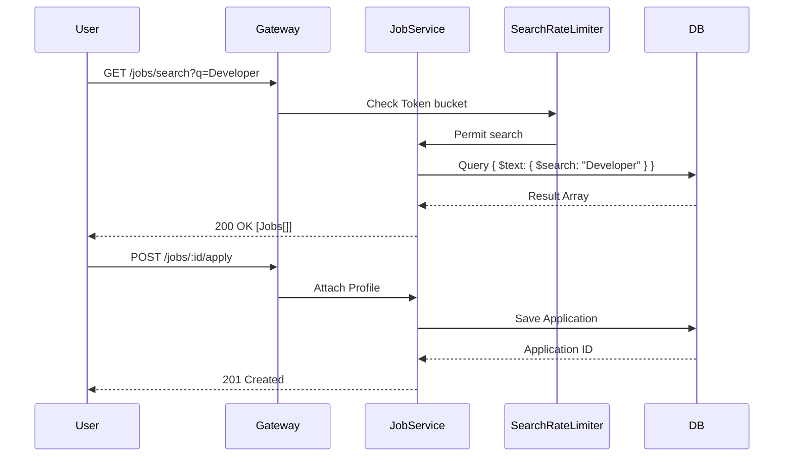

# API Reference

## Endpoint Families
The application exposes a wide variety of REST API controllers across multiple domains. Below are some of the inferred endpoints mapped to domains:

- **Auth endpoints:** Registration, Login, Social Login (Google, Facebook, GitHub, LinkedIn), Password Resets.
- **Community endpoints:** Posts, feed updates, commenting.
- **Job Portal endpoints:** Searching platforms, posting jobs.
- **Course Platforms endpoints:** Course modules, videos, progress tracking.
- **AI Tool endpoints:** AI wrappers via OpenAI (e.g. `openai.api.key` configurations).
- **Payment endpoints:** Handling Stripe checkouts and webhook listeners for events like `invoice.payment_succeeded`.

## General Specifications
### Request/Response Data Format
All APIs accept and return `application/json` uncompressed and accept `gzip` encoding. The `Jackson` library maps all payloads.

### Authentication Requirements
Endpoints inside the `_private` folders or labeled `api/v1/private/...` require a valid JWT `Authorization: Bearer <token>` header issued during the login flow.
Public endpoints (like `/oauth2/callback/*`, `/health`, webhooks) usually are configured in `SecurityAutoConfiguration` whitelist.

### Error Handling Format
Common error wrapper from `shared` domain (usually a `@ControllerAdvice` mapping custom `Exception` classes to `ResponseEntity` containing `{ "code", "message", "timestamp", "details" }`).

### Rate Limiting Behavior
Rate limits are applied via `Resilience4j`. For example:
- `postLimiter` handles new posts at `5 requests / 30s` per caller.
- `searchLimiter` restricts global search capability to `10 searches / 1 minute` per caller to prevent Database exhaustion.

## OpenAPI-style Example (Authentication)

### **POST** `/auth/login`
**Description:** Authenticates the user and returns an identity token.

**Request Schema:**
```json
{
  "email": "user@example.com",
  "password": "strongPassword123"
}
```

**Response Schema (200 OK):**
```json
{
  "token": "eyJhbGciOi...",
  "user": {
    "id": "60e8d0e5...",
    "roles": ["USER"]
  }
}
```

## Critical Flows Sequence

**Job Search and Application Flow:**


## WebSocket Configuration
The system uses `spring-boot-starter-websocket`.
Clients connect via specific context paths, enabling real-time features like notifications or chat messages. 

## Revision Summary
- Created base API documentation mapped to current Spring configurations.
- Added typical Domain controllers overview.
- Reflected actual applied Resilience4J configurations from `application.properties`.
