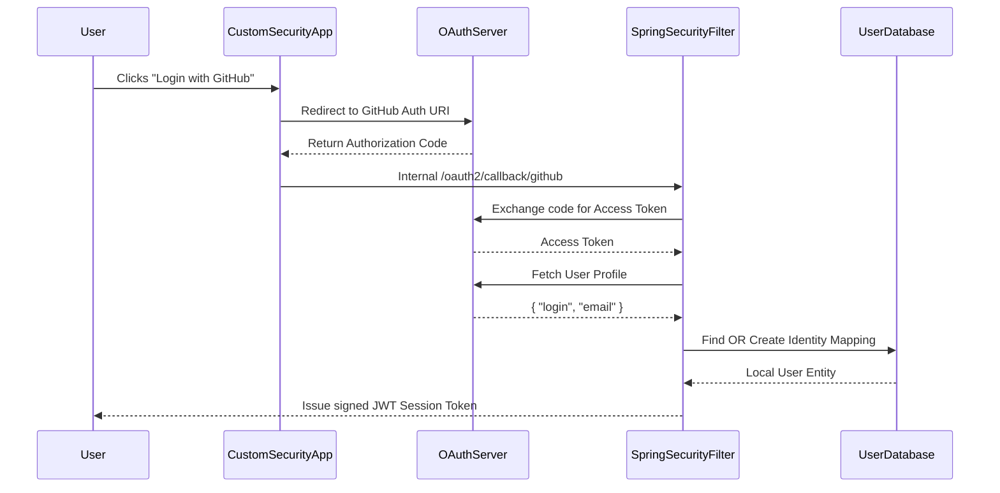

# Authentication and Authorization

## Mechanism Overview
Talentboozt leverages Spring Security coupled tightly with **JWT (JSON Web Tokens)** for stateless internal security, and extensively supports **OAuth2 Client logic** for third-party federated identity access.

## Token Lifecycle
- Tokens are generated using the `io.jsonwebtoken:jjwt` library and signed via a secret key configured in `jwt-token.secret`.
- A successful login response issues the JWT to the client.
- The client injects the token as an `Authorization: Bearer <token>` in subsequent HTTP headers.
- Filter chains in `config/security` intercept requests, validate signatures and expiry, and populate the `SecurityContext`.

## Supported Social Providers
The `application.properties` establishes integrations via `spring.security.oauth2.client.registration` for:
- Google (Profile, email)
- GitHub (User, email)
- Facebook (Email, public_profile, GraphAPI v19.0)
- LinkedIn (LiteProfile, email, OAuth v2)

For custom processing, LinkedIn requires custom provider mappings targeting `https://api.linkedin.com/v2/me` and `.../v2/emailAddress`.

## Role Model & Permission System
While strictly dependent on the database `User` collection arrays, traditional roles like `USER`, `ADMIN`, `AMBASSADOR` and `EMPLOYER` govern authorization boundaries.
The path hierarchy in controllers maps permission boundaries natively:
- `/api/v1/_private/**`: Strictly `ADMIN` or highly elevated roles.
- `/api/v1/_public/**`: Anonymous access or read-only metrics.
- `/api/v1/...`: Authorized active sessions.

## End-to-End Auth Flow

## Security Filters
Multiple Custom Filter architectures are enabled. Spring security auto-configuration filters are disabled for servlet architectures (`spring.autoconfigure.exclude=org.springframework.boot.autoconfigure.security.servlet.SecurityAutoConfiguration`) intentionally to enable heavily customized domain-specific mappings or webflux-compatible pipelines if running hybrid. Application uses `dispatcher-types=REQUEST,ERROR`.

## Protection from Exfiltration
Token leakage is mitigated via relatively short-lived JWT lifetimes (refresh tokens optionally enabled based on clients). Furthermore, CORS filters dictate strict origin requests to `login.talnova.io` and the main domain endpoints.

## Revision Summary
- Updated OAuth identity provider integration strategies based on active `.env` parameters.
- Modeled standard Authentication security filter patterns against `jjwt` dependencies.
- Updated the latest supported Meta API version references to v19.0.
