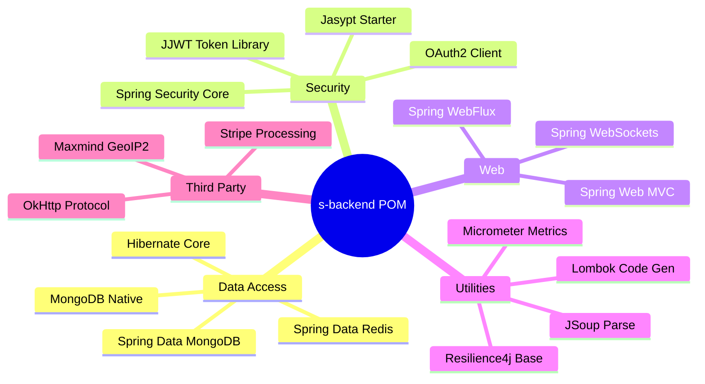

# Project Dependencies

## Dependency Grouping
The Talentboozt `s-backend` relies on standard `org.springframework.boot` BOM dependencies built natively for Spring Framework 6 / Spring Boot 3 architectures. They are categorized below:

### Core Framework
- **`spring-boot-starter-web`:** Foundational Tomcat-based REST framework.
- **`spring-boot-starter-webflux`:** Enables non-blocking API clients and WebClient.
- **`spring-boot-starter-websocket`:** Powers real-time chat, notifications, and telemetry.

### Data Storage & Operations
- **`spring-boot-starter-data-mongodb`:** Spring Data NoSQL integrations mapping `@Document` boundaries.
- **`spring-boot-starter-data-redis`:** Enables session and fast in-memory key-value lookups.
- **`mongodb-driver-sync`:** Standard MongoDB interaction.
- **`hibernate-core`:** Legacy/Compatibility usage mapped alongside annotations (Version 5.4.32.Final).

### Identity & Access
- **`spring-boot-starter-security`:** Manages authentication endpoints.
- **`spring-boot-starter-oauth2-client`:** Integrated federated login setups.
- **`jjwt-api`, `jjwt-impl`, `jjwt-jackson` (0.11.5):** Generates and handles JWT parsing and identity tokens.

### Resiliency & Monitoring
- **`spring-boot-starter-actuator`:** Standard endpoint observability (health, metrics, loggers).
- **`micrometer-core` / `context-propagation` (1.1.2):** Standard Prometheus and distributed system tracing.
- **`resilience4j-spring-boot3` (2.1.0):** Used for configuring sophisticated retry policies, circuit breakers (`resilience4j-circuitbreaker`), rate limiters.

### Third-Party APIs
- **`stripe-java` (28.2.0):** Manages the payment processing lifecycle inherently in Stripe’s API models.
- **`spring-boot-starter-mail`:** SMTP client configuration for email transactions.

### Utilities
- **`spring-dotenv` (4.0.0):** Mounts the local `.env` values dynamically.
- **`lombok`:** Annotations to auto-generate POJOs getters/setters minimizing boilerplate code.
- **`okhttp` (4.9.0) / `httpclient5`:** Client requests inside custom third-party integrations (like custom OAuth providers or specific Webhook interactions).
- **`caffeine` (3.1.8):** Fast JVM-local caching.
- **`jsoup` (1.16.1):** Parsing, extracting, and sanitizing HTML data.
- **`geoip2` (2.15.0):** Geolocation mapping of IP requests to localized coordinates and data.
- **`jasypt-spring-boot-starter` (3.0.4):** Transparent encryption inside Spring configurations.

## Dependency Graph Overview

## Internal vs External Packages
As a monolithic domain-driven application mapping multiple architectures, all domain integrations exist internally under `src/main/java/com/talentboozt`.
Custom components inside `config/` strictly integrate the explicit BOM libraries described below natively to decouple implementation specifics.

## Risk-Prone / Critical Dependencies
- Extensively coupled with **Spring Boot 3.4.3**; breaking release notes inside subcomponents (like `spring-security`) mandate heavy refactoring.
- Deprecation of certain **Hibernate 5.x** core references should be monitored if used alongside Java 17 setups.
- **`stripe-java`** relies structurally on valid Stripe API versions on its backend. Version parity across AWS configuration must be maintained to parse correctly.

## Revision Summary
- Created unified internal Dependency map based on the `pom.xml` configuration of Spring Boot 3.
- Mapped explicit utility modules integration relationships.
