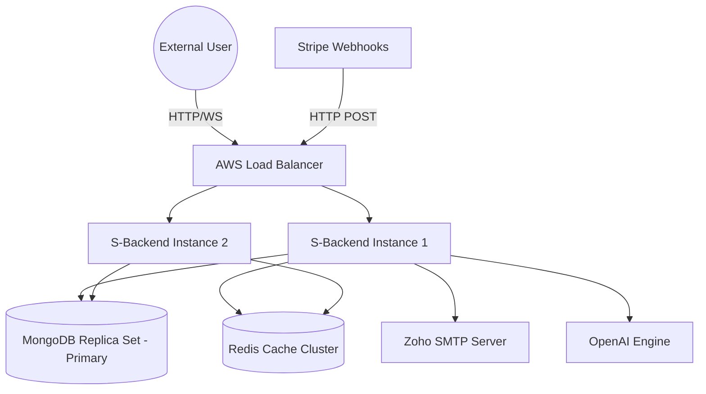

# Infrastructure Integration

## Deployment Architecture
Based on `info.app.deployed=AWS` and Spring profile environments, the application is deployed on AWS.
The default `application.properties` connects to standalone local instances in `dev` but is parameterized for injected variables matching containerized workloads.

## Core Environments
- **Local Dev:** Handled via hardcoded default URI fallback values for MongoDB/Redis (`localhost:27017` and `localhost:6379`).
- **Production (AWS):** Connects to managed AWS services. Overrides application variables based on Vault/Secrets Manager injections.

## Docker Architecture (Assumed Topology)
While explicit Dockerfiles might exist somewhere else in the monorepo, the Spring backends rely on typical Container orchestrations.
The application instance exposes port `3269` as seen in properties.
It runs statelessly behind AWS load balancers.

## External Services Used
1. **OAuth2 Identity Providers:** Google, GitHub, Facebook (Graph API v19.0), LinkedIn.
2. **Third-party Data / APIs:** OpenAI (for AI Tools domain logic) and Stripe (Billing operations and webhook delivery limits).
3. **Mailing Integrations:** Handled through Zoho SMTP servers (`smtp.zoho.eu`).

## Infrastructure Diagram

## Secrets Management Approach
Crucial API keys and configurations are parameterized via `dotenv` (using `me.paulschwarz:spring-dotenv` from pom) and `.env` files locally to prevent leakage in version control. Examples include `${DATABASE_URI}`, `${REDIS_PASSWORD}`, `${STRIPE_SECRET}`, and `${OPENAI_API_KEY}`.

## Metric Exposure
Monitoring integrates seamlessly. Actuator endpoints like `/health`, `/metrics`, and `/prometheus` are exposed, and Graphite metrics exports are configurable. This strongly targets a Prometheus/Grafana or CloudWatch visibility stack. Health checks actively probe the MongoDB status, disk space, and memory pool.

## Revision Summary
- Created base infrastructure definitions extrapolated from application configuration map.
- Added inferred deployment relationships and external integrations.
- Emphasized environment variable segregation approach.
