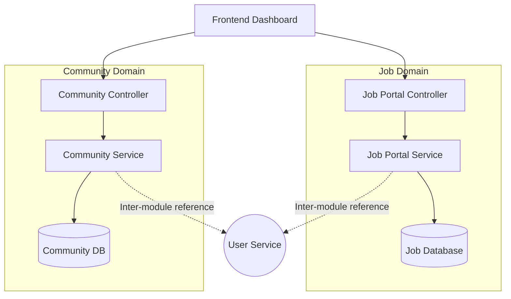

# Module Breakdown

## Extracted Bounded Contexts
The application is structured into domain packages. These represent bounded contexts in Domain-Driven Design (DDD). Each module generally encapsulates its own controllers, services, repositories, and models.

### `ai_tool`
- **Responsibility:** Integrating OpenAI endpoints to provide advanced content matching or prompt generation.
- **Key Files:** Controllers for AI generation.
- **Dependencies:** `com.talentboozt.shared`, OpenAI external clients.

### `ambassador`
- **Responsibility:** Managing ambassador programs, unique referral flows, and commission tracking.
- **Key Files:** `AmbassadorController`, `AmbassadorService`.
- **Dependencies:** User identities, payment components for commissions.

### `article` & `announcement`
- **Responsibility:** Publishing knowledge base articles or system-wide announcements to communities.
- **Dependencies:** Shared DTOs and `community` domain.

### `audit_logs` & `sys_tracking`
- **Responsibility:** Tracking user activities, generating event metrics, and maintaining system logs. Uses batched insert mechanisms to avoid overwhelming I/O (`audit.batch-size=100`, `audit.flush-interval-s=5`).
- **Dependencies:** System-wide Event Listeners.

### `auth` & `user`
- **Responsibility:** Managing identity lifecycle, OAuth flows, and traditional JWT session verification.
- **Public Interfaces:** `/auth/register`, `/auth/login`, OAuth2 callbacks.

### `com_courses` & `plat_courses`
- **Responsibility:** Delivering Learning Management workflows. "com_" prefix denotes community-driven content, while "plat_" signifies platform-curated learning paths.

### `com_job_portal` & `plat_job_portal`
- **Responsibility:** Allowing employers to post jobs and seekers to apply.

### `community`, `reputation`, & `messaging`
- **Responsibility:** Tracking upvotes, downvotes, generating user badges based on contribution. Handling direct and group Websocket messaging.
- **Dependencies:** User Profiles, Activity Logs.

### `payment`
- **Responsibility:** Integrating Stripe billing API natively via `stripe-java`.
- **Public Interfaces:** Connects with `stripe.webhook.secret` protected endpoints to parse invoice/subscription updates.

## Internal Flow Architecture Example

## Revision Summary
- Mapped currently existing domain structure dynamically.
- Addressed functional separation of Com vs Plat modules.
