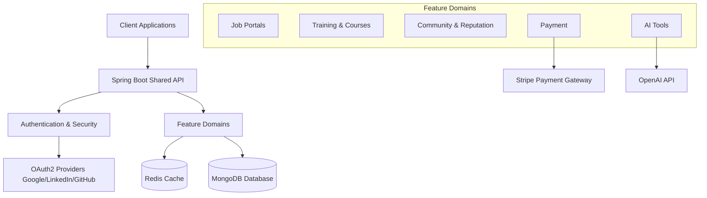
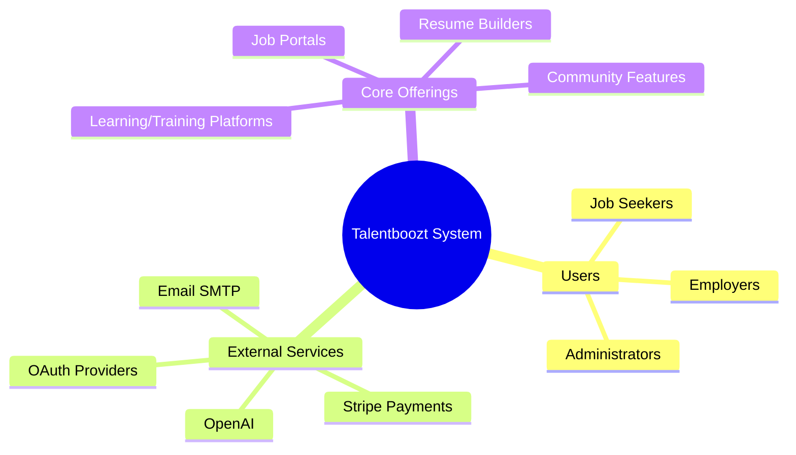

# Product Overview

## Summary
Talentboozt Server is the main backend application for all common SAaS products under the Talentboozt umbrella. It provides a shared backend infrastructure for products including Job Portals, Resume Builders, Training Platforms, and various APIs.

## Core Problem Solved
Providing a unified, scalable, and centralized backend infrastructure to operate multiple SaaS-based talent management, recruitment, and learning platforms without duplication of core services (like Authentication, Payment, Audit Logs, AI Tools, and Messaging).

## Target Users
- **Job Seekers/Candidates:** Accessing job portals, resume builders, and training platforms.
- **Employers/Recruiters:** Accessing candidate matching tools, job postings, and community engagement.
- **Administrators/Ambassadors:** Monitoring system tracking, managing content, and platform administration.

## Key Features
- **Job Portal Management:** Dedicated modules for community-based and platform-wide job portals.
- **Training & Courses:** Infrastructure for managing both community and platform-level courses.
- **Centralized Authentication:** Robust identity management supporting local login, JWT, and OAuth2 integrations (Google, GitHub, Facebook, LinkedIn).
- **Payment Processing:** Integrated Stripe billing and webhook handling.
- **AI Tool Integrations:** Features leveraging OpenAI APIs for intelligent resume screening or matching.
- **Community & Reputation:** Mechanisms for tracking user reputation, badges, and community announcements.
- **Messaging:** Inter-user messaging capabilities.
- **System Tracking & Audit Logs:** Comprehensive tracking of events and user actions for analytics and compliance.

## High-Level Capabilities
- Modular Domain-Driven architecture allowing independent scaling of different functional domains.
- Real-time communication via WebSockets.
- Caching layer via Redis and Caffeine for optimal performance.
- Resilient external API integrations managed by Resilience4j.
- Scalable NoSQL storage backed by MongoDB.

## Value Proposition
By consolidating all common core services into a single modular monolith, Talentboozt reduces time-to-market for new platform features while ensuring high availability, consistent security standards, and rapid integration of modern capabilities like AI and resilient data processing.

## High-Level Architecture Diagram

## System Context Diagram

## Revision Summary
- Created initial documentation to reflect current architecture.
- Synced with latest code changes and system configurations.
