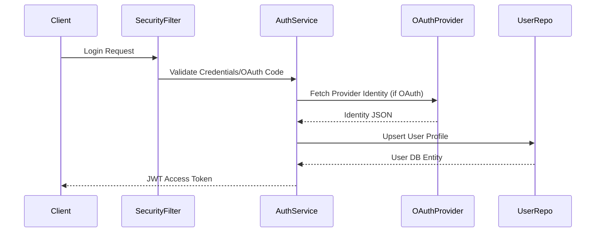
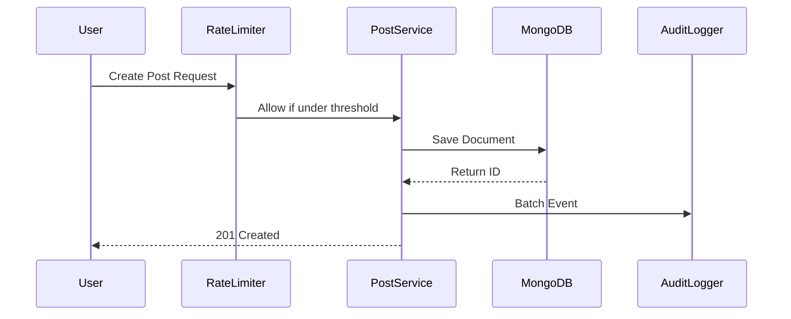
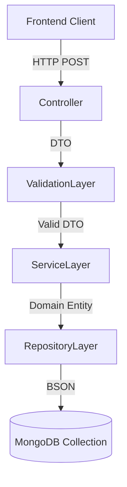

# System Design

## Deep Architectural Explanation
The Talentboozt application leverages Spring Web MVC and Spring WebFlux (for potential reactive parts and WebSockets) behind an API Gateway pattern. Since it contains multiple product backends in one `s-backend` project, it acts as a centralized brain for community features, platform content, job boards, user reputation, and billing.

The system relies heavily on `Caffeine` for JVM-local caching and `Redis` for distributed caching. Application resilience is guaranteed by `resilience4j` rate limiters and circuit breakers configuration for heavy endpoints like search and post creation.

## Request Lifecycle
1. **Ingress:** HTTP Request arrives at the main Spring Boot embedded Tomcat server.
2. **Security Filter Chain:** Validates headers, parses JWT tokens using `jjwt`, or initiates OAuth2 flow.
3. **Rate Limiting:** `Resilience4j` intercepts requests (e.g., `postLimiter`, `searchLimiter`) and allows or rejects execution.
4. **Controller Routing:** The request reaches the respective REST controller.
5. **Service Layer Execution:** The controller calls domain services, invoking business validation.
6. **Data Access Layer:** Service makes queries to MongoDB via Spring Data repositories.
7. **Cross-Cutting Concerns:** Audit components (configured in `application.properties` with batching logic) asynchronously write activity records to the database.
8. **Egress:** Responses are built and serialized into JSON via Jackson.

## Sequence Diagrams

**Authentication Flow:**

**Content Creation Flow with Resilience:**

## Data Flow Diagrams

## State Management
Application state is fundamentally mostly stateless at the web tier. All request-scoped state relies on JWT claims.
Long-lived transient state (like passwords reset tokens) is saved to Redis or MongoDB.
WebSocket sessions store connection references in-memory or Redis to push events.

## Multi-environment Behavior
Based on `info.app.environment` and profile properties:
- **Dev:** Uses local MongoDB and Redis bindings, verbose logging, and non-strict CORS (usually).
- **Staging/Prod:** Uses actual AWS-managed databases (based on `DATABASE_URI`), strict rate limits, and actual Stripe/OpenAI secrets.

## Revision Summary
- Updated architectural designs for current configuration and request paths.
- Synced state management references with Redis and MongoDB.
- Synced Resilience4j integration flows.
