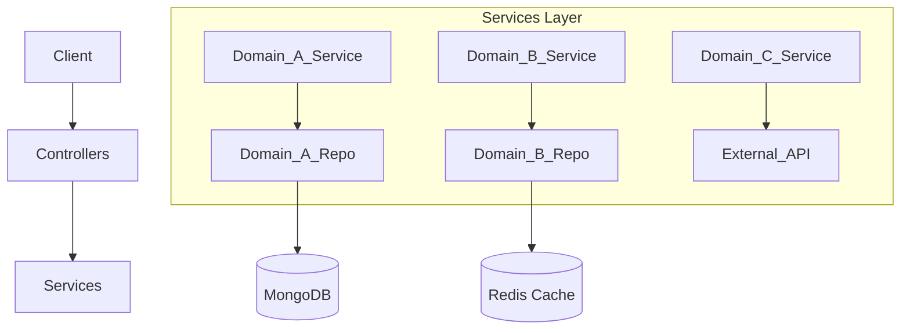
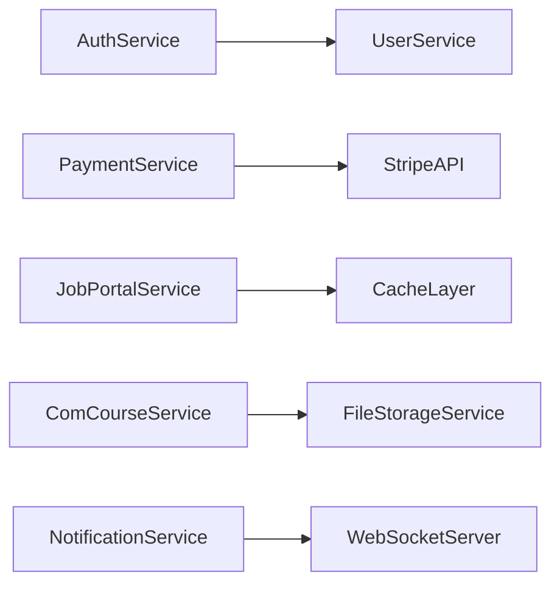

# Technical Architecture

## Architecture Style
The Talentboozt `s-backend` application is built as a **Modular Monolith** using Spring Boot 3.4.3. The system is designed based on **Domain-Driven Design (DDD)** principles to separate concerns into cohesive business domains (e.g., Auth, Job Portal, Training, Payment) while sharing necessary core utilities in a `shared` package.

## Component Breakdown
The codebase is structured under `com.talentboozt.s_backend` into the following primary directories:

- **`config`**: Global Spring configuration components, bean initializers, WebSocket setup, OAuth integrations, resilience definitions, and CORS policies.
- **`domains`**: The core feature implementations.
- **`shared`**: Common utilities, shared DTOs, global exception handlers, base repository classes, logging aspects, and security primitives.

## Folder Structure Explanation
```
src/main/java/com/talentboozt/s_backend/
├── config/             # Global configurations (e.g., Security, Swagger, Stripe)
├── domains/            # Independent bounded contexts
│   ├── _private/       # Features exclusive to specific admin roles
│   ├── _public/        # Features with unbound access
│   ├── ai_tool/        # OpenAI API wrappers
│   ├── attr/           # Profile/Job attributes
│   ├── auth/           # Login, JWT issuing, Registration
│   ├── platform_areas/ # Multiple modules like plat_courses, com_job_portal
│   └── user/           # User lifecycle management
└── shared/             # Reusable beans across domains
```

## Dependency Graph



## Service Interaction Diagram



## Design Patterns Used
1. **Repository Pattern:** Abstraction over MongoDB using Spring Data repositories.
2. **Strategy Pattern:** Commonly used for handling varying OAuth2 provider logins.
3. **Facade Pattern:** Aggregation of complex domain interactions inside unified controller endpoints.
4. **Builder Pattern:** Construction of complex immutable DTOs and API responses.

## Scalability Considerations
- **Stateless Architecture:** All session data is either stored in Redis or managed via stateless JWTs.
- **Circuit Breakers:** `Resilience4j` provides circuit breaking, retries, and rate-limiting on outgoing calls (like external AI APIs or Stripe).
- **Asynchronous Processing:** Long-running requests (like sending emails) are offloaded to task executors or handled asynchronously.

## Fault Tolerance Mechanisms
- Multi-node MongoDB connections supported through flexible URI properties.
- Redis redundancy configurations can be passed down.
- Application-level retries for unreliable external dependencies.

## Revision Summary
- Updated to reflect current Modular Monolith architecture pattern.
- Synced with latest Spring Boot 3 dependencies and directory structure.
