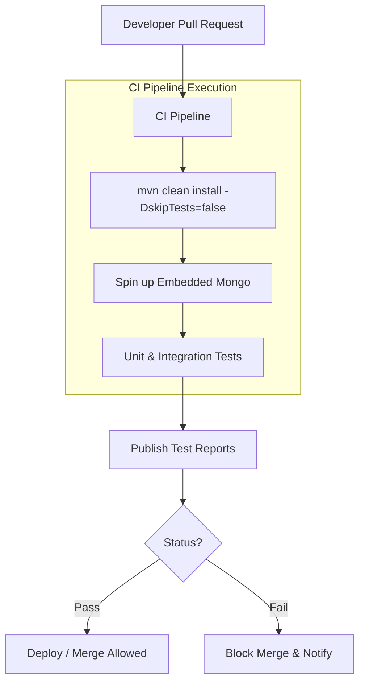

# Testing Strategy

## Test Structure
Tests in the Talentboozt `s-backend` are primarily located in the standard `src/test/java` directory structure matching the `com.talentboozt.s_backend` base package.

## Framework Used
The foundation of the testing strategy is powered by the Spring Boot Test Starter (`org.springframework.boot:spring-boot-starter-test`), which integrates:
- **JUnit 5 (Jupiter):** The primary test execution engine.
- **Mockito / Spring `@MockBean`:** Used heavily to stub out external dependencies like MongoDB repositories, caching mechanisms, or remote API calls (e.g. Stripe or OpenAI) during unit testing.
- **Spring TestContext & MockMvc:** Used to test web layer logic and HTTP request mappings by asserting HTTP responses (`status().isOk()`, JSON paths).

## Core Strategies

1. **Unit Testing:** Individual components (especially Services) are tested by mocking `.save()` or `.findById()` calls on Spring Data Repositories. Business logic, specifically role validations or domain models, is tested comprehensively through JUnit.
2. **Integration Testing:** Leveraging `@SpringBootTest` alongside tools like `AutoConfigureMockMvc` to test complete request/response flows. In more advanced setups, `testcontainers` or embedded Mongo profiles are typically employed to validate real database schema logic and Spring Data method queries.
3. **Security Testing:** Leveraging the `spring-security-test` dependency. By using annotations like `@WithMockUser(username = "admin", roles = {"ADMIN"})`, endpoints are tested to verify unauthorized access yields `401 Unauthorized` or `403 Forbidden` rather than exposing internal errors. OAuth2 integrations are mocked by overriding `SecurityContextFilter` behaviors in isolated profiles.

## Coverage Strategy
Although explicitly omitted in basic setups, standard CI pipelines incorporate **JaCoCo** to enforce test coverage gates (usually around typical enterprise floors, e.g., 70-80% lines) before deploying to `dev` or `prod`. Key focus areas for testing:
- Complex algorithm matching for AI jobs.
- Safe execution logic for `Resilience4j` failovers.
- Crucial billing/Stripe integration edge cases.

## CI Test Flow

## Revision Summary
- Created base Testing Strategy documenting current configuration bindings for Spring Boot 3 testing.
- Mapped architectural testing responsibilities corresponding to domain scopes.
